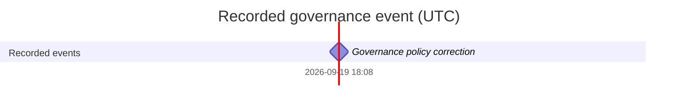

# Stage 0 ZenJev Gantt / Kanban projection

Generated read-only projection. The sole authority is [stage0_zenjev_blueprint.md](stage0_zenjev_blueprint.md).
No implementation acceptance is implied by generating this file.

**Source blueprint:** `Docs/stage0_zenjev_blueprint.md`
**Source SHA-256:** `85cb659dc2e89490e1210b0ae7f66556c4183f3bd3a12f58083a0f33c75f7770`
**Specification SHA-256:** `53cd7fad80ce52bb3e21aa4d0c1b2299a0da024cac104f9fab3e91034829d90f`
**Generated at (UTC):** `2026-09-20T08:46:55Z`
**Generation command:** `python3 scripts/validate_blueprint.py --generate`
**Check command:** `python3 scripts/validate_blueprint.py --check`

## Monitoring summary

| Surface | Value |
|---|---|
| Checklist items | 39 |
| Todo / self-tested / Master-accepted | 39 / 0 / 0 |
| Controller | disabled; operator concurrency/lifecycle/route unresolved |
| Logical claims / service records / admitted executions | not applicable; no controller ledger |
| Startup reservations / live transports / authenticated goals / running turns | not applicable; no controller ledger |
| Request starts/window / in-flight / outstanding requests | not applicable; no controller ledger |
| Validator / integration leases; handoff / integration / repair backlog | not applicable; no controller ledger |
| Breaker / saturation / underfill | not applicable; activation disabled, no capacity target authorized |
| Telemetry scope | future repository controller only; does not count the current interactive session |
| Timing | every checklist item is unscheduled |

## Recorded event Gantt

Only the recorded governance edit is plotted. It is a zero-duration event, not a task estimate or completion date.

## Unscheduled monitoring index

Each stable checklist ID has exactly one row. Owners are planned roles; no row claims a live execution.
The validation-preparation frontier consists of unfinished items; it authorizes preparing checks, never early acceptance.

| ID | State | Depends on | Planned owner | Owned paths | Claim / run | Frontier | Validation preparation | Startup / live / handoff / integration / repair | Blocked | Timing | Gate |
|---|---|---|---|---|---|---|---|---|---|---|---|---|
| ZJ-001 | todo | — | Master | `configs/example.yaml`, `artifacts/model_manifest.json`, `Docs/researches/**` | unclaimed / none | implementation | pending | not applicable (controller disabled) | none from DAG | Unscheduled | G0,G3,G4,G5 |
| ZJ-002 | todo | ZJ-001 | Master | `.gitignore`, `jev/`, `tests/`, `scripts/`, `Docs/` | unclaimed / none | waiting_dependencies | pending | not applicable (controller disabled) | unfinished dependencies: ZJ-001 | Unscheduled | G0 |
| ZJ-003 | todo | ZJ-002 | Master | `scripts/validate_blueprint.py`, `tests/test_governance.py`, `Docs/stage0_zenjev_blueprint.md`, `Docs/stage0_zenjev_blueprint_Gantt.md` | unclaimed / none | waiting_dependencies | pending | not applicable (controller disabled) | unfinished dependencies: ZJ-002 | Unscheduled | G0 |
| ZJ-004 | todo | ZJ-002 | Schema worker | `jev/config.py`, `jev/distill.py`, `configs/example.yaml`, `tests/test_jev.py` | unclaimed / none | waiting_dependencies | pending | not applicable (controller disabled) | unfinished dependencies: ZJ-002 | Unscheduled | G1,G2,G3,G4 |
| ZJ-010 | todo | ZJ-004 | Schema worker | `jev/config.py`, `configs/example.yaml`, `tests/test_jev.py` | unclaimed / none | waiting_dependencies | pending | not applicable (controller disabled) | unfinished dependencies: ZJ-004 | Unscheduled | G1 |
| ZJ-011 | todo | ZJ-004 | Data worker | `jev/sources.py`, `jev/config.py`, `configs/example.yaml`, `tests/test_jev.py` | unclaimed / none | waiting_dependencies | pending | not applicable (controller disabled) | unfinished dependencies: ZJ-004 | Unscheduled | G1,G2 |
| ZJ-012 | todo | ZJ-004,ZJ-011 | Distillation worker | `jev/distill.py`, `jev/config.py`, `configs/example.yaml`, `tests/test_jev.py` | unclaimed / none | waiting_dependencies | pending | not applicable (controller disabled) | unfinished dependencies: ZJ-004,ZJ-011 | Unscheduled | G2 |
| ZJ-013 | todo | ZJ-011 | Data worker | `jev/sources.py`, `jev/distill.py`, `artifacts/provenance/`, `tests/test_jev.py` | unclaimed / none | waiting_dependencies | pending | not applicable (controller disabled) | unfinished dependencies: ZJ-011 | Unscheduled | G1,G2 |
| ZJ-014 | todo | ZJ-010,ZJ-012,ZJ-013 | Distillation worker | `jev/distill.py`, `artifacts/datasets/`, `tests/test_jev.py` | unclaimed / none | waiting_dependencies | pending | not applicable (controller disabled) | unfinished dependencies: ZJ-010,ZJ-012,ZJ-013 | Unscheduled | G2 |
| ZJ-020 | todo | ZJ-001,ZJ-002 | Model worker | `jev/model.py`, `configs/example.yaml`, `tests/test_jev.py` | unclaimed / none | waiting_dependencies | pending | not applicable (controller disabled) | unfinished dependencies: ZJ-001,ZJ-002 | Unscheduled | G3,G6 |
| ZJ-021 | todo | ZJ-020 | Training worker | `jev/training.py`, `jev/model.py`, `configs/example.yaml`, `tests/test_jev.py` | unclaimed / none | waiting_dependencies | pending | not applicable (controller disabled) | unfinished dependencies: ZJ-020 | Unscheduled | G3 |
| ZJ-022 | todo | ZJ-021 | Training worker | `jev/ema.py`, `jev/runtime.py`, `jev/training.py`, `tests/test_jev.py` | unclaimed / none | waiting_dependencies | pending | not applicable (controller disabled) | unfinished dependencies: ZJ-021 | Unscheduled | G4 |
| ZJ-023 | todo | ZJ-022,ZJ-020 | Runtime worker | `jev/runtime.py`, `jev/training.py`, `tests/test_jev.py` | unclaimed / none | waiting_dependencies | pending | not applicable (controller disabled) | unfinished dependencies: ZJ-022,ZJ-020 | Unscheduled | G4 |
| ZJ-024 | todo | ZJ-021,ZJ-022,ZJ-004 | Evaluation worker | `jev/drift.py`, `jev/config.py`, `configs/example.yaml`, `tests/test_jev.py` | unclaimed / none | waiting_dependencies | pending | not applicable (controller disabled) | unfinished dependencies: ZJ-021,ZJ-022,ZJ-004 | Unscheduled | G5 |
| ZJ-025 | todo | ZJ-024,ZJ-020 | Training worker | `jev/training.py`, `jev/runtime.py`, `tests/test_jev.py` | unclaimed / none | waiting_dependencies | pending | not applicable (controller disabled) | unfinished dependencies: ZJ-024,ZJ-020 | Unscheduled | G5 |
| ZJ-026 | todo | ZJ-010,ZJ-020,ZJ-022 | Inference worker | `jev/model.py`, `jev/runtime.py`, `tests/test_jev.py` | unclaimed / none | waiting_dependencies | pending | not applicable (controller disabled) | unfinished dependencies: ZJ-010,ZJ-020,ZJ-022 | Unscheduled | G1,G4 |
| ZJ-027 | todo | ZJ-014,ZJ-023,ZJ-025,ZJ-026 | Master | `jev/runtime.py`, `jev/training.py`, `jev/cli.py`, `tests/test_jev.py`, `scripts/smoke.py` | unclaimed / none | waiting_dependencies | pending | not applicable (controller disabled) | unfinished dependencies: ZJ-014,ZJ-023,ZJ-025,ZJ-026 | Unscheduled | G2,G4,G5 |
| ZJ-028 | todo | ZJ-026 | Schema worker | `configs/jev_tool_task.yaml`, `jev/config.py`, `jev/tool_task.py`, `tests/test_model_config_distill.py` | unclaimed / none | waiting_dependencies | pending | not applicable (controller disabled) | unfinished dependencies: ZJ-026 | Unscheduled | G1,G4,G9 |
| ZJ-029 | todo | ZJ-011,ZJ-028 | Data worker | `jev/sources.py`, `jev/tool_task.py`, `configs/jev_tool_task.yaml`, `tests/test_jev.py` | unclaimed / none | waiting_dependencies | pending | not applicable (controller disabled) | unfinished dependencies: ZJ-011,ZJ-028 | Unscheduled | G1,G2,G9 |
| ZJ-030 | todo | ZJ-001,ZJ-020 | Hardware worker | `scripts/validate_nvidia_gpu.py`, `artifacts/hardware/`, `Docs/runbooks/` | unclaimed / none | waiting_dependencies | pending | not applicable (controller disabled) | unfinished dependencies: ZJ-001,ZJ-020 | Unscheduled | G6 |
| ZJ-031 | todo | ZJ-027,ZJ-030 | Hardware worker | `scripts/smoke_nvidia_gpu.py`, `benchmarks/`, `artifacts/benchmarks/`, `tests/benchmarks/` | unclaimed / none | waiting_dependencies | pending | not applicable (controller disabled) | unfinished dependencies: ZJ-027,ZJ-030 | Unscheduled | G6 |
| ZJ-032 | todo | ZJ-014,ZJ-027 | Evaluation worker | `artifacts/evaluations/`, `jev/drift.py`, `tests/test_jev.py` | unclaimed / none | waiting_dependencies | pending | not applicable (controller disabled) | unfinished dependencies: ZJ-014,ZJ-027 | Unscheduled | G2,G4,G5 |
| ZJ-033 | todo | ZJ-025,ZJ-031 | Evaluation worker | `artifacts/recovery/`, `tests/recovery/` | unclaimed / none | waiting_dependencies | pending | not applicable (controller disabled) | unfinished dependencies: ZJ-025,ZJ-031 | Unscheduled | G5,G6 |
| ZJ-034 | todo | ZJ-011,ZJ-012,ZJ-013,ZJ-014,ZJ-051 | Master | `artifacts/audits/`, `Docs/runbooks/` | unclaimed / none | waiting_dependencies | pending | not applicable (controller disabled) | unfinished dependencies: ZJ-011,ZJ-012,ZJ-013,ZJ-014,ZJ-051 | Unscheduled | G1,G2,G7,G10 |
| ZJ-035 | todo | ZJ-026,ZJ-028,ZJ-029 | Inference worker | `jev/model.py`, `jev/tool_task.py`, `jev/runtime.py`, `tests/test_model_config_distill.py` | unclaimed / none | waiting_dependencies | pending | not applicable (controller disabled) | unfinished dependencies: ZJ-026,ZJ-028,ZJ-029 | Unscheduled | G4,G9 |
| ZJ-036 | todo | ZJ-032,ZJ-035 | Evaluation worker | `artifacts/evaluations/`, `tests/test_jev.py`, `tests/test_model_config_distill.py` | unclaimed / none | waiting_dependencies | pending | not applicable (controller disabled) | unfinished dependencies: ZJ-032,ZJ-035 | Unscheduled | G5,G9 |
| ZJ-037 | todo | ZJ-023,ZJ-035 | Runtime worker | `jev/runtime.py`, `jev/training.py`, `tests/test_jev.py` | unclaimed / none | waiting_dependencies | pending | not applicable (controller disabled) | unfinished dependencies: ZJ-023,ZJ-035 | Unscheduled | G4,G9 |
| ZJ-040 | todo | ZJ-010,ZJ-011,ZJ-027 | Docs worker | `jev/cli.py`, `Docs/runbooks/`, `README.md`, `tests/test_jev.py` | unclaimed / none | waiting_dependencies | pending | not applicable (controller disabled) | unfinished dependencies: ZJ-010,ZJ-011,ZJ-027 | Unscheduled | G1,G4,G5 |
| ZJ-041 | todo | ZJ-031,ZJ-032,ZJ-034,ZJ-040,ZJ-051 | Master | `artifacts/repro/`, `Docs/runbooks/`, `requirements*.txt`, `pyproject.toml` | unclaimed / none | waiting_dependencies | pending | not applicable (controller disabled) | unfinished dependencies: ZJ-031,ZJ-032,ZJ-034,ZJ-040,ZJ-051 | Unscheduled | G0,G6,G7,G10 |
| ZJ-042 | todo | ZJ-003,ZJ-027,ZJ-031,ZJ-033,ZJ-041,ZJ-053,ZJ-055 | Master | `Docs/stage0_zenjev_blueprint.md`, `Docs/stage0_zenjev_blueprint_Gantt.md`, `.zenjev/runtime/` | unclaimed / none | waiting_dependencies | pending | not applicable (controller disabled) | unfinished dependencies: ZJ-003,ZJ-027,ZJ-031,ZJ-033,ZJ-041,ZJ-053,ZJ-055 | Unscheduled | G0–G11 as applicable |
| ZJ-043 | todo | ZJ-042 | Master | `.git/`, `artifacts/delivery/github_receipt.json` | unclaimed / none | waiting_dependencies | pending | not applicable (controller disabled) | unfinished dependencies: ZJ-042 | Unscheduled | G7 |
| ZJ-044 | todo | ZJ-042,ZJ-043,ZJ-054 | Hardware worker/Master | `artifacts/delivery/remote_transfer_receipt.json`, `artifacts/hardware/remote_*.json` | unclaimed / none | waiting_dependencies | pending | not applicable (controller disabled) | unfinished dependencies: ZJ-042,ZJ-043,ZJ-054 | Unscheduled | G6,G7,G11 |
| ZJ-045 | todo | ZJ-043,ZJ-044 | Master | `Docs/stage0_zenjev_blueprint.md`, `Docs/stage0_zenjev_blueprint_Gantt.md`, `.zenjev/runtime/` | unclaimed / none | waiting_dependencies | pending | not applicable (controller disabled) | unfinished dependencies: ZJ-043,ZJ-044 | Unscheduled | G8 |
| ZJ-050 | todo | ZJ-004,ZJ-011 | Schema worker | `jev/config.py`, `configs/example.yaml`, `tests/test_jev.py` | unclaimed / none | waiting_dependencies | pending | not applicable (controller disabled) | unfinished dependencies: ZJ-004,ZJ-011 | Unscheduled | G10 |
| ZJ-051 | todo | ZJ-050 | MQ worker | `mq/`, `scripts/smoke_mq.py`, `tests/test_mq.py` | unclaimed / none | waiting_dependencies | pending | not applicable (controller disabled) | unfinished dependencies: ZJ-050 | Unscheduled | G10 |
| ZJ-052 | todo | ZJ-037,ZJ-050 | Runtime worker | `jev/mq.py`, `jev/runtime.py`, `jev/training.py`, `tests/test_jev.py` | unclaimed / none | waiting_dependencies | pending | not applicable (controller disabled) | unfinished dependencies: ZJ-037,ZJ-050 | Unscheduled | G10 |
| ZJ-053 | todo | ZJ-051,ZJ-052 | Evaluation worker | `tests/test_mq.py`, `mq/tests/`, `scripts/smoke_mq.py`, `artifacts/mq/` | unclaimed / none | waiting_dependencies | pending | not applicable (controller disabled) | unfinished dependencies: ZJ-051,ZJ-052 | Unscheduled | G10 |
| ZJ-054 | todo | ZJ-031,ZJ-053 | Hardware worker | `scripts/smoke_mq_nvidia_gpu.py`, `benchmarks/mq/`, `artifacts/benchmarks/`, `Docs/runbooks/` | unclaimed / none | waiting_dependencies | pending | not applicable (controller disabled) | unfinished dependencies: ZJ-031,ZJ-053 | Unscheduled | G6,G11 |
| ZJ-055 | todo | ZJ-040,ZJ-052 | Docs worker | `jev/cli.py`, `Docs/runbooks/`, `README.md`, `tests/test_jev.py` | unclaimed / none | waiting_dependencies | pending | not applicable (controller disabled) | unfinished dependencies: ZJ-040,ZJ-052 | Unscheduled | G10,G11 |

## Reconciliation

The checker reconstructs this entire file from the authoritative source and recorded generation time. Any stale digest, count, dependency, owner, owned path, state, frontier, omitted/duplicate ID or invented timing fails verification. Generation uses an atomic replacement and never edits authoritative checklist state. Future controller activation requires a policy migration and ledger-aware projection; this tool cannot activate it.
