# Stage 0 ZenJev Gantt / Kanban projection

**Projection type:** generated, read-only monitoring surface. It is never parsed as requirements authority and contains no mutable checklist marks. The sole authority is [stage0_zenjev_blueprint.md](stage0_zenjev_blueprint.md).  
**Source blueprint:** `Docs/stage0_zenjev_blueprint.md`  
**Source SHA-256:** `d03416382ff1369fb777c12079d3a17a71fc5ebce51ad73066c64ca6f6e1374a`  
**Specification SHA-256:** `d03416382ff1369fb777c12079d3a17a71fc5ebce51ad73066c64ca6f6e1374a` (initial frozen specification is embedded in the source blueprint)  
**Generated at (UTC):** `2026-09-19T17:32:09Z`  
**Generation policy:** The initial run has no recorded start/finish timestamps. The render below uses a relative one-day planning estimate solely to keep a renderable Gantt view; every monitoring row remains `unscheduled` until a controller records timestamps. No calendar date is implied.

## Monitoring summary

| Surface | Value |
|---|---:|
| Checklist items | 28 |
| Todo items | 28 |
| Self-tested handoffs | 0 |
| Master-accepted items | 0 |
| Active claims / admitted executions | 0 / 0 |
| Startup reservations / live transports | 0 / 0 |
| Authenticated goals / running turns | 0 / 0 |
| Request starts in current window / in-flight / outstanding | 0 / 0 / 0 |
| Integration / repair backlog | 0 / 0 |
| Breaker | closed (no request has been submitted) |
| Binding underfill reason | no scheduler tick has reserved a claim; all items are dependency-gated or unclaimed |
| Timing | unscheduled; no recorded timestamps |

## Renderable relative Gantt

```mermaid
gantt
title Stage 0 ZenJev (relative planning view; not calendar commitments)
dateFormat X
axisFormat %s
section Governance and contracts
ZJ-001 :zj001, 0, 1d
ZJ-002 :zj002, 0, 1d
ZJ-003 :zj003, 0, 1d
ZJ-004 :zj004, 0, 1d
section Schema and distillation
ZJ-010 :zj010, 0, 1d
ZJ-011 :zj011, 0, 1d
ZJ-012 :zj012, 0, 1d
ZJ-013 :zj013, 0, 1d
ZJ-014 :zj014, 0, 1d
section Model training and inference
ZJ-020 :zj020, 0, 1d
ZJ-021 :zj021, 0, 1d
ZJ-022 :zj022, 0, 1d
ZJ-023 :zj023, 0, 1d
ZJ-024 :zj024, 0, 1d
ZJ-025 :zj025, 0, 1d
ZJ-026 :zj026, 0, 1d
ZJ-027 :zj027, 0, 1d
section Validation and operator surfaces
ZJ-030 :zj030, 0, 1d
ZJ-031 :zj031, 0, 1d
ZJ-032 :zj032, 0, 1d
ZJ-033 :zj033, 0, 1d
ZJ-034 :zj034, 0, 1d
ZJ-040 :zj040, 0, 1d
ZJ-041 :zj041, 0, 1d
section Publication and delivery
ZJ-042 :zj042, 0, 1d
ZJ-043 :zj043, 0, 1d
ZJ-044 :zj044, 0, 1d
ZJ-045 :zj045, 0, 1d
```

## Monitoring index

Each authoritative checklist ID appears exactly once below. `todo`, `self_tested`, and `accepted` are projection words for the three allowed source states; this generated file does not mutate those states. `Unscheduled` is intentional until durable timestamps exist.

| ID | State | Depends on | Owner | Claim / run | Startup / live / handoff / integration / repair / blocked | Timing | Gate |
|---|---|---|---|---|---|---|---|
| ZJ-001 | todo | — | Master | unclaimed | 0 / 0 / 0 / 0 / 0 / 0 | Unscheduled | G0,G3,G4,G5 |
| ZJ-002 | todo | ZJ-001 | Master | unclaimed | 0 / 0 / 0 / 0 / 0 / 0 | Unscheduled | G0 |
| ZJ-003 | todo | ZJ-002 | Master | unclaimed | 0 / 0 / 0 / 0 / 0 / 0 | Unscheduled | G0,G8 |
| ZJ-004 | todo | ZJ-002 | Schema worker | unclaimed | 0 / 0 / 0 / 0 / 0 / 0 | Unscheduled | G1,G2,G3,G4 |
| ZJ-010 | todo | ZJ-004 | Schema worker | unclaimed | 0 / 0 / 0 / 0 / 0 / 0 | Unscheduled | G1 |
| ZJ-011 | todo | ZJ-004 | Data worker | unclaimed | 0 / 0 / 0 / 0 / 0 / 0 | Unscheduled | G1,G2 |
| ZJ-012 | todo | ZJ-004,ZJ-011 | Distillation worker | unclaimed | 0 / 0 / 0 / 0 / 0 / 0 | Unscheduled | G2 |
| ZJ-013 | todo | ZJ-011 | Data worker | unclaimed | 0 / 0 / 0 / 0 / 0 / 0 | Unscheduled | G1,G2 |
| ZJ-014 | todo | ZJ-010,ZJ-012,ZJ-013 | Distillation worker | unclaimed | 0 / 0 / 0 / 0 / 0 / 0 | Unscheduled | G2 |
| ZJ-020 | todo | ZJ-001,ZJ-002 | Model worker | unclaimed | 0 / 0 / 0 / 0 / 0 / 0 | Unscheduled | G3,G6 |
| ZJ-021 | todo | ZJ-020 | Training worker | unclaimed | 0 / 0 / 0 / 0 / 0 / 0 | Unscheduled | G3 |
| ZJ-022 | todo | ZJ-021 | Training worker | unclaimed | 0 / 0 / 0 / 0 / 0 / 0 | Unscheduled | G4 |
| ZJ-023 | todo | ZJ-022,ZJ-020 | Runtime worker | unclaimed | 0 / 0 / 0 / 0 / 0 / 0 | Unscheduled | G4 |
| ZJ-024 | todo | ZJ-021,ZJ-022,ZJ-004 | Evaluation worker | unclaimed | 0 / 0 / 0 / 0 / 0 / 0 | Unscheduled | G5 |
| ZJ-025 | todo | ZJ-024,ZJ-020 | Training worker | unclaimed | 0 / 0 / 0 / 0 / 0 / 0 | Unscheduled | G5 |
| ZJ-026 | todo | ZJ-010,ZJ-020,ZJ-022 | Inference worker | unclaimed | 0 / 0 / 0 / 0 / 0 / 0 | Unscheduled | G1,G4 |
| ZJ-027 | todo | ZJ-014,ZJ-023,ZJ-025,ZJ-026 | Master | unclaimed | 0 / 0 / 0 / 0 / 0 / 0 | Unscheduled | G2,G4,G5 |
| ZJ-030 | todo | ZJ-001,ZJ-020 | Hardware worker | unclaimed | 0 / 0 / 0 / 0 / 0 / 0 | Unscheduled | G6 |
| ZJ-031 | todo | ZJ-027,ZJ-030 | Hardware worker | unclaimed | 0 / 0 / 0 / 0 / 0 / 0 | Unscheduled | G6 |
| ZJ-032 | todo | ZJ-014,ZJ-027 | Evaluation worker | unclaimed | 0 / 0 / 0 / 0 / 0 / 0 | Unscheduled | G2,G4,G5 |
| ZJ-033 | todo | ZJ-025,ZJ-031 | Evaluation worker | unclaimed | 0 / 0 / 0 / 0 / 0 / 0 | Unscheduled | G5,G6 |
| ZJ-034 | todo | ZJ-011,ZJ-012,ZJ-013,ZJ-014 | Master | unclaimed | 0 / 0 / 0 / 0 / 0 / 0 | Unscheduled | G1,G2,G7 |
| ZJ-040 | todo | ZJ-010,ZJ-011,ZJ-027 | Docs worker | unclaimed | 0 / 0 / 0 / 0 / 0 / 0 | Unscheduled | G1,G4,G5 |
| ZJ-041 | todo | ZJ-031,ZJ-032,ZJ-034,ZJ-040 | Master | unclaimed | 0 / 0 / 0 / 0 / 0 / 0 | Unscheduled | G0,G6,G7 |
| ZJ-042 | todo | ZJ-003,ZJ-027,ZJ-031,ZJ-033,ZJ-041 | Master | unclaimed | 0 / 0 / 0 / 0 / 0 / 0 | Unscheduled | G0–G8 as applicable |
| ZJ-043 | todo | ZJ-042 | Master | unclaimed | 0 / 0 / 0 / 0 / 0 / 0 | Unscheduled | G7 |
| ZJ-044 | todo | ZJ-042,ZJ-043 | Hardware worker/Master | unclaimed | 0 / 0 / 0 / 0 / 0 / 0 | Unscheduled | G6,G7 |
| ZJ-045 | todo | ZJ-043,ZJ-044 | Master | unclaimed | 0 / 0 / 0 / 0 / 0 / 0 | Unscheduled | G8 |

## Projection freshness and reconciliation

The controller must atomically replace this file after every state merge, update both digests and the generation timestamp, and reject a tick when the index is missing, duplicated, stale, or out of sync with the authoritative checklist. At completion, the projection remains available after runtime cleanup and proves zero unfinished source items, zero pending handoffs, zero integration/repair entries, and current source/specification digests.
