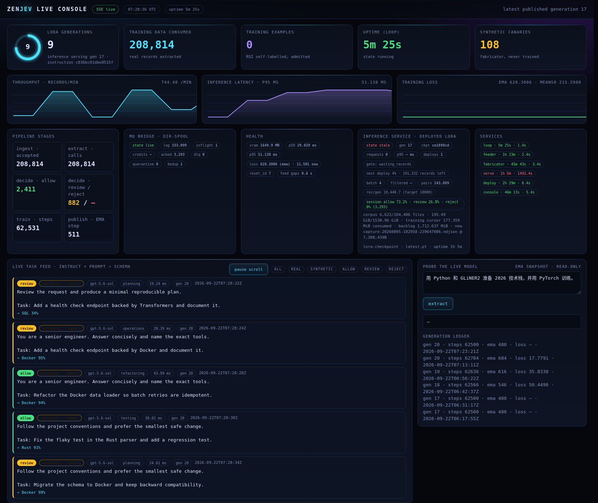

# ZenJev

Schema-driven information extraction runtime around the **GLiNER2 205M** checkpoint with PEFT LoRA adapters, trained on a real capture corpus produced by the **flagship model GPT-5.6-sol** (agent traces with tools, patches, tests and terminal work). The control plane stays dependency-light: `jev-core` validates configuration, provenance, drift/reset policy, EMA state and concurrent publication without importing PyTorch.



*Live console (`http://<host>:8790/`), captured from the running RTX 5090 host. The feed is filtered to project-authored synthetic canaries so no operator data appears in the image.*

## Production status on the RTX 5090 (Stage 0.1)

The 5090 host runs the accepted pipeline as **perpetual, train-and-serve-in-one** services: ingestion never stops, training never stops, and inference keeps serving while it trains. Nothing is a demo shortcut: the queue is a real Rust dir-spool MQ over the operator's capture tree, the trainer publishes real adapter generations, and the deployed inference service is redeployed onto new LoRA checkpoints on a record cadence.

| Surface | Live evidence (2026-09-22) |
|---|---|
| Training data consumed | **208,814** real records from the GPT-5.6-sol capture corpus, cursor at 6,622 / 104,486 dump files (195.5 GiB) |
| Distillation pairs trained | **143,869** `(instruction + request -> schema)` pairs, 100% schema-conformant |
| LoRA generations | epoch-aligned, **one generation per 10,000 consumed records** (`rec/gen 10,440`, target 10,000) |
| Inference | standalone perpetual service on `0.0.0.0:8791`, deployed LoRA `gen 17`, redeploy gate every 200,000 records |
| Decision mix | **allow 2,411 / review 882 / reject 0** — policy holds only planning/research for review |
| Latency / VRAM | p50 29.0 ms, p95 51.1 ms, 1.65 GB VRAM allocated (205M + LoRA) |
| Resilience | warm start across config edits, resume from checkpoint + spool watermark, kill-injection drill recorded |
| Observability | SSE console with generation ring, throughput/latency/loss charts, MQ lag/credits/DLQ, corpus + training cursors, scrolling task feed, live model probe |

Services: `zenjev-feeder`, `zenjev-loop`, `zenjev-fabricator`, `zenjev-serve`, `zenjev-deploy`, `zenjev-console` (systemd user units, `loginctl enable-linger`). Quick start:

```bash
bash scripts/install_zenjev_services.sh   # install + start
scripts/zenjev_services.sh status         # units + console URL
scripts/zenjev_services.sh health         # heartbeats, gaps, sessions, deploy progress
scripts/zenjev_services.sh evidence       # freeze acceptance evidence
```

The authoritative implementation plan is [`Docs/stage0_zenjev_blueprint.md`](Docs/stage0_zenjev_blueprint.md); operations live in [`Docs/runbooks/perpetual_operations.md`](Docs/runbooks/perpetual_operations.md).

---

# ZenJev(中文)

围绕 **GLiNER2 205M** + PEFT LoRA 的 schema 驱动信息抽取 runtime,训练数据来自**旗舰模型 GPT-5.6-sol 的真实抓取语料**(带工具调用、补丁、测试、终端操作的 agent trace)。控制面保持轻依赖:`jev-core` 在不引入 PyTorch 的前提下完成配置、来源、漂移/重置策略、EMA 与并发发布的校验。


*实时面板(`http://<host>:8790/`),截图取自正在运行的 RTX 5090 主机;任务流已过滤为项目自造的合成 canary,画面中不含任何你的真实数据。*

## RTX 5090 上的生产状态(Stage 0.1)

5090 主机上跑的是已验收的流水线,以**永续、训推一体**的方式常驻:摄入不停、训练不停、推理在训练期间持续对外服务。没有演示捷径:队列是真正基于抓取目录的 Rust dir-spool MQ,训练器发布真实的 adapter 代际,推理服务按记录节奏被重新部署到新的 LoRA 检查点。

| 观测面 | 实时证据(2026-09-22) |
|---|---|
| 训练数据消耗 | **208,814** 条 GPT-5.6-sol 真实抓取记录,游标 6,622 / 104,486 个 dump 文件(195.5 GiB) |
| 已训练蒸馏配对 | **143,869** 对 `(instruction + request → schema)`,100% 符合 schema |
| LoRA 代际 | 账本 epoch 对齐,**每消费 10,000 条发布一代**(`rec/gen 10,440`,目标 10,000) |
| 推理服务 | 独立永续服务 `0.0.0.0:8791`,当前部署 LoRA `gen 17`,每 20 万条触发重部署闸门 |
| 决策分布 | **allow 2,411 / review 882 / reject 0** —— 仅 planning/research 按策略留在 review |
| 延迟 / 显存 | p50 29.0 ms,p95 51.1 ms,显存占用 1.65 GB(205M + LoRA) |
| 韧性 | 配置变更热启动、从检查点+队列水位续跑、SIGKILL 注入演练均有记录 |
| 可观测 | SSE 面板:代际环、吞吐/延迟/loss 曲线、MQ lag/credits/DLQ、语料与训练游标、滚动任务流、在线模型探针 |

服务:`zenjev-feeder`、`zenjev-loop`、`zenjev-fabricator`、`zenjev-serve`、`zenjev-deploy`、`zenjev-console`(systemd user 单元 + `loginctl enable-linger`)。快速开始:

```bash
bash scripts/install_zenjev_services.sh   # 安装并启动
scripts/zenjev_services.sh status         # 服务状态 + 面板地址
scripts/zenjev_services.sh health         # 心跳、空洞、会话、部署进度
scripts/zenjev_services.sh evidence       # 冻结验收证据
```

权威实施计划见 [`Docs/stage0_zenjev_blueprint.md`](Docs/stage0_zenjev_blueprint.md),运维手册见 [`Docs/runbooks/perpetual_operations.md`](Docs/runbooks/perpetual_operations.md)。
